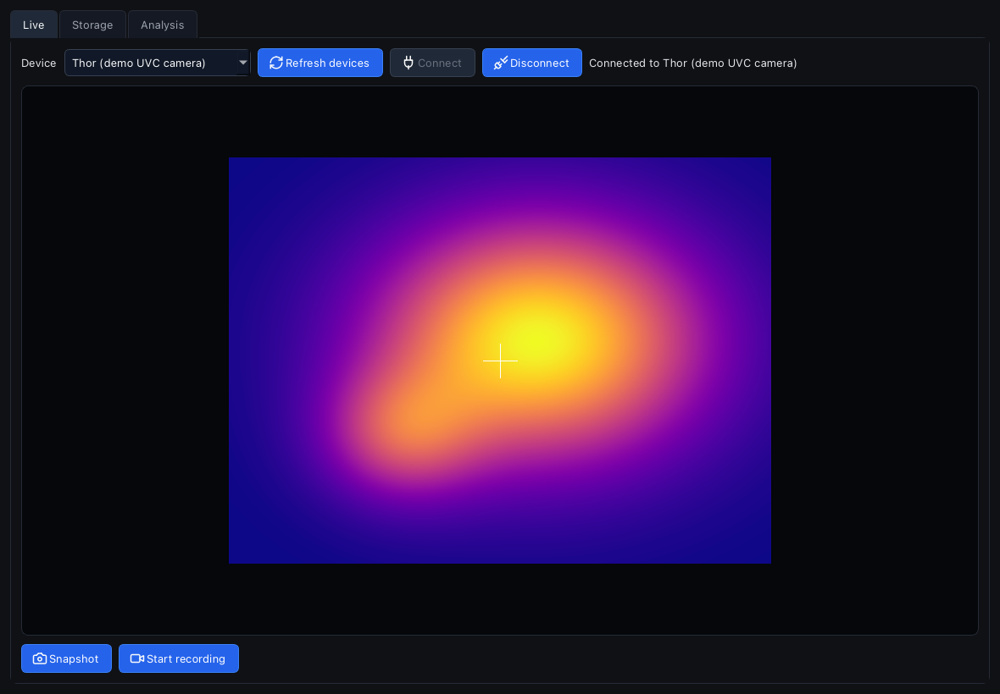
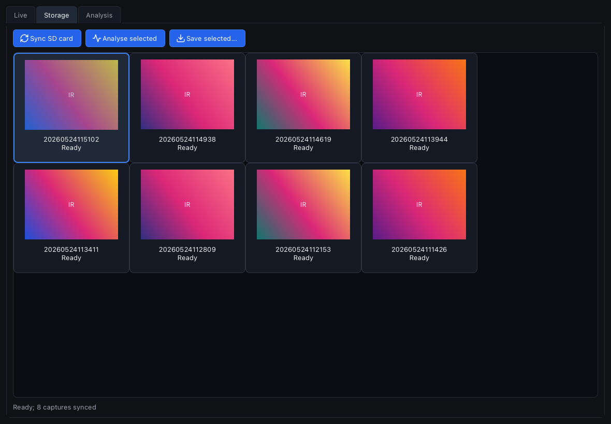
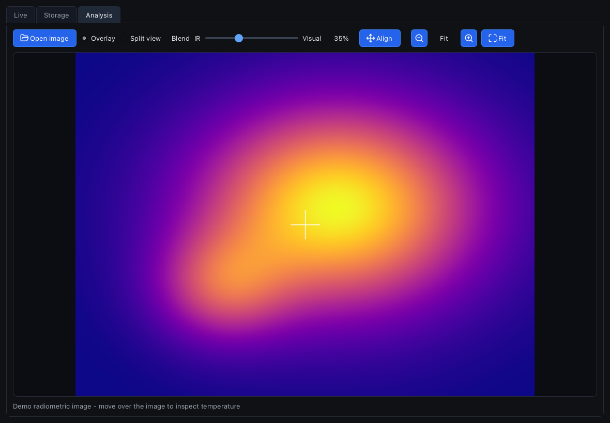
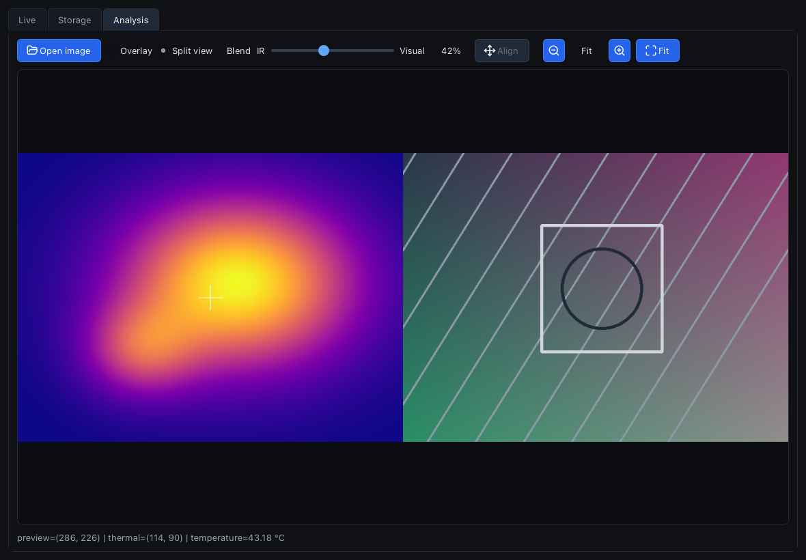

# Thor Viewer

Thor Viewer is an open-source, cross-platform desktop alternative to Thermal Master's TM Thor PC app. It is built for the ThermalMaster Thor UVC thermal camera and focuses on live viewing, SD-card capture sync, and basic radiometric image analysis.

## Features

- Live UVC camera view with snapshot and recording controls
- Thor SD-card browser with automatic missing-file sync over MTP
- Radiometric JPEG preview and temperature readout
- Analysis tab for downloaded IR captures
- Python/PySide6 app intended to run on macOS, Linux, and Windows

## Screenshots

Screenshots below use generated demo data.









## Requirements

- Python 3.10+
- A ThermalMaster Thor camera
- `uv` for dependency management
- MTP command-line tools available on your platform (`mtp-files`, `mtp-getfile`) for SD-card sync

## Run

```bash
uv sync
uv run thor-viewer
```

If the camera is not detected, open the Live tab, refresh devices, and connect the Thor camera. Open the Storage tab to sync SD-card captures into `thor_downloads/`.

## Troubleshooting

### Windows: Thor camera is not detected

If the Thor appears in Device Manager or Wireshark/USBPcap but Thor Viewer says "No Thor camera found", check camera privacy and security-app permissions:

- Open Windows Settings > Privacy & security > Camera and enable camera access for desktop apps.
- If you use Bitdefender or another antivirus/privacy tool, allow webcam/camera access for Thor Viewer, Python, or the terminal you use to run `uv run thor-viewer`.
- Close other apps that may already be using the Thor camera, then restart Thor Viewer and press Refresh devices.

## Development

```bash
uv run python -m unittest discover -s tests
uv run python -m compileall src scripts main.py
```

The helper scripts in `scripts/` are for MTP and radiometric JPEG inspection. Downloaded captures, recordings, snapshots, virtual environments, and local IDE files are ignored by git.

## Package

On macOS, build a `.app` bundle with:

```bash
uv sync --group build
uv run --group build python scripts/build_app.py
open "dist/Thor Viewer.app"
```

Run the same build command on Windows or Linux to create native PyInstaller artifacts for that OS. The script bundles app SVG assets, generates platform icons (`.icns` on macOS, `.ico` on Windows, hicolor PNG icons plus a `.desktop` file on Linux), and writes a zip or tarball in `dist/`.

PyInstaller is not a cross-compiler, so build each release on the target OS. SD-card sync still requires `mtp-files` and `mtp-getfile` to be installed on the target system.

## Status

This project is early-stage and reverse-engineered from observed Thor camera files and device behavior. ThermalMaster is a trademark of its owner; this project is independent and not affiliated with ThermalMaster.

## License

MIT
